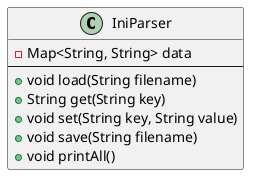
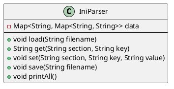
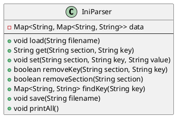
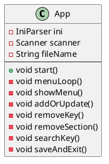

# Les fichiers

Pour lire et écrire dans des fichiers Java propose plusieurs solutions.

## Les méthodes classiques

### Écriture

La classe `FileWriter` permet d'écrire du texte dans un fichier.

```Java
import java.io.FileWriter;
import java.io.IOException;

public class FileWriteExample {
    public static void main(String[] args) {
        String filePath = "output.txt";
        
        try (FileWriter writer = new FileWriter(filePath)) {
            writer.write(
                "Bonjour, ceci est une ligne de texte.\n"
            );
            writer.write(
                "Écriture de plusieurs lignes dans un fichier."
            );
            
            System.out.println("Écriture terminée !");
            
        } catch (IOException e) {
            e.printStackTrace();
        }
    }
}
```

- Par défaut, le contenu précédent du fichier est écrasé.
- Ouvrir la ressource dans le `try` garantit la fermeture automatique du fichier (pas besoin de `finally`).

#### Écriture optimisée avec un tampon

La mise en tampon de l'écriture limite les accès disque et donc améliore la performance.

```java
import java.io.BufferedWriter;
import java.io.FileWriter;
import java.io.IOException;

public class BufferedWriteExample {
    public static void main(String[] args) {
        String filePath = "output.txt";
        try (
            BufferedWriter writer = new BufferedWriter(
                new FileWriter(filePath)
            )
        ) 
        {
            writer.write("Première ligne optimisée.\n");
            writer.write(
                "Deuxième ligne écrite avec BufferedWriter."
            );
            
            // Ajoute une nouvelle ligne
            writer.newLine();  
            
            System.out.println(
                "Écriture terminée avec BufferedWriter !"
            );
        } catch (IOException e) {
            e.printStackTrace();
        }
    }
}
```

#### Ajout à un fichier (append)

Il suffit de passer `true` en deuxième argument du constructeur de `FileWriter`.

```java
// true active le mode append
new FileWriter("output.txt", true); 
```

### Lecture de fichiers

#### Lecture caractère par caractère

```java
import java.io.FileReader;
import java.io.IOException;

public class FileReadExample {
    public static void main(String[] args) {
        String filePath = "output.txt";
        try (FileReader reader = new FileReader(filePath)) {
            int character;
            while ((character = reader.read()) != -1) {
                System.out.print((char) character);
            }
        } catch (IOException e) {
            e.printStackTrace();
        }
    }
}
```

#### Lecture avec un tampon

La classe `BufferedReader` permet de lire ligne par ligne, ce qui est plus efficace.

```java
import java.io.BufferedReader;
import java.io.FileReader;
import java.io.IOException;

public class BufferedReadExample {
    public static void main(String[] args) {
        String filePath = "output.txt";
        try (
            BufferedReader reader = new BufferedReader(
                new FileReader(filePath)
            )
        ) 
        {
            String line;
            while ((line = reader.readLine()) != null) {
                System.out.println(line);
            }
        } catch (IOException e) {
            e.printStackTrace();
        }
    }
}
```

## Les "nouvelles" méthodes

Depuis Java 7, il est possible de lire et d'écrire dans un fichier avec une syntaxe simplifiée en utilisant le package `nio` (new IO).

### Écriture {id="criture_1"}

```java
import java.io.IOException;
import java.nio.file.Files;
import java.nio.file.Paths;
import java.nio.charset.StandardCharsets;
import java.util.List;

public class FilesWriteExample {
    public static void main(String[] args) {
        String filePath = "output.txt";
        List<String> lines = List.of("Ligne 1", "Ligne 2", "Ligne 3");
        try {
            Files.write(
                Paths.get(filePath), 
                lines, 
                StandardCharsets.UTF_8
            );
            System.out.println("Écriture terminée avec Files.write() !");
        } catch (IOException e) {
            e.printStackTrace();
        }
    }
}
```

### Lecture

Pour la lecture, `nio` permet le chargement de l'ensemble du fichier dans une liste de chaînes.

```java
import java.io.IOException;
import java.nio.file.Files;
import java.nio.file.Paths;
import java.util.List;

public class FilesReadExample {
    public static void main(String[] args) {
        String filePath = "output.txt";
        try {
            List<String> lines = Files.readAllLines(
                Paths.get(filePath)
            );
            for (String line : lines) {
                System.out.println(line);
            }
        } catch (IOException e) {
            e.printStackTrace();
        }
    }
}
```

## Les fichiers binaires
Pour lire ou écrire du contenu binaire, il faut utiliser les classe `FileInputStream` et `FileOutputStream`.

### Écriture de contenu binaire

```java
import java.io.FileOutputStream;
import java.io.IOException;

public class BinaryFileWrite {
    public static void main(String[] args) {
        String filePath = "binary.dat";
        byte[] data = {65, 66, 67, 68, 69}; // ASCII : A, B, C, D, E

        try (FileOutputStream fos = new FileOutputStream(filePath)) {
            fos.write(data);
            System.out.println("Fichier binaire écrit avec succès !");
        } catch (IOException e) {
            e.printStackTrace();
        }
    }
}
```

Il est également possible d'ajouter un tampon pour améliorer la performance en utilisant la classe `BufferedOutputStream. L'écriture s'effectuera par bloc plutôt qu'octet par octet.

```java
import java.io.BufferedOutputStream;
import java.io.FileOutputStream;
import java.io.IOException;

public class BufferedBinaryWrite {
    public static void main(String[] args) {
        String filePath = "binary.dat";
        byte[] data = {73, 74, 75}; // ASCII : I, J, K

        try (
            BufferedOutputStream bos = new BufferedOutputStream(
                new FileOutputStream(filePath, true)
            )
        ) 
        {
            bos.write(data);
            System.out.println("Écriture optimisée avec BufferedOutputStream !");
        } catch (IOException e) {
            e.printStackTrace();
        }
    }
}
```

### Lecture de contenu binaire

```java
import java.io.FileInputStream;
import java.io.IOException;

public class BinaryReadExample {
    public static void main(String[] args) {
        String filePath = "binary.dat";
        try (FileInputStream fis = new FileInputStream(filePath)) {
            int byteData;
            while ((byteData = fis.read()) != -1) {
                System.out.print((char) byteData);
            }
        } catch (IOException e) {
            e.printStackTrace();
        }
    }
}

```

Comme pour l'écriture, il est possible d'utiliser un tampon.

```java
import java.io.BufferedInputStream;
import java.io.FileInputStream;
import java.io.IOException;

public class BufferedBinaryRead {
    public static void main(String[] args) {
        String filePath = "binary.dat"; // Fichier binaire à lire

        try (
            BufferedInputStream bis = new BufferedInputStream(
                new FileInputStream(filePath)
            )
        ) 
        {
            int byteData;
            while ((byteData = bis.read()) != -1) {
                // Affiche chaque octet
                System.out.print(byteData + " "); 
            }
            System.out.println("\nLecture terminée !");
        } catch (IOException e) {
            e.printStackTrace();
        }
    }
}
```

## Copie d'un fichier binaire ou texte 

```java
import java.io.IOException;
import java.nio.file.Files;
import java.nio.file.Path;
import java.nio.file.StandardCopyOption;

public class FilesCopyExample {
    public static void main(String[] args) {
        Path sourcePath = Path.of("source.txt");
        Path destinationPath = Path.of("destination.txt");

        try {
            Files.copy(
                sourcePath, 
                destinationPath, 
                StandardCopyOption.REPLACE_EXISTING
            );
            System.out.println("Fichier copié avec Files.copy() !");
        } catch (IOException e) {
            e.printStackTrace();
        }
    }
}
```

<!--
```java
import java.io.FileInputStream;
import java.io.FileOutputStream;
import java.io.IOException;

public class BinaryFileCopy {
    public static void main(String[] args) {
        String sourceFile = "image.jpg";
        String destinationFile = "copy_image.jpg";

        try (
               FileInputStream fis = new FileInputStream(sourceFile);
               FileOutputStream fos = new FileOutputStream
                  (destinationFile)
             ) 
         {

            // 1 Ko de buffer
            byte[] buffer = new byte[1024]; 
            int bytesRead;
            while ((bytesRead = fis.read(buffer)) != -1) {
                fos.write(buffer, 0, bytesRead);
            }
            System.out.println("Fichier binaire copié avec succès !");
        } catch (IOException e) {
            e.printStackTrace();
        }
    }
}

```
-->

## La sérialisation

La sérialisation en Java est le processus de conversion d’un objet en un flux de bits afin de pouvoir le stocker (dans un fichier, une base de données, etc.) ou le transmettre (par exemple via un réseau). Ce flux peut ensuite être désérialisé pour recréer l’objet original.

**Conditions pour la sérialisation**

- La classe de l’objet doit implémenter l’interface `Serializable`.

- Tous les objets contenus dans l’objet principal doivent, eux aussi, être sérialisables.

- On peut marquer certains champs comme transitoires (transient) pour les exclure de la sérialisation.

### Exemples simples

Soit une classe `Person

```java
class Person implements Serializable {
    private String name;
    private int age;

    // Constructeur
    public Person(String name, int age) {
        this.name = name;
        this.age = age;
    }

    // Méthode pour affichage
    public String toString() {
        return "Name: " + name + ", Age: " + age;
    }
}
```

#### Le code de la sérialisation

```java
import java.io.*;

public class SerializeExample {
    public static void main(String[] args) {
        Person p = new Person("Alice", 30);

        try {
            // Sérialisation dans un fichier
            FileOutputStream fileOut = new FileOutputStream("person.ser");
            ObjectOutputStream out = new ObjectOutputStream(fileOut);
            out.writeObject(p);
            out.close();
            fileOut.close();
            System.out.println("Objet sérialisé dans person.ser");
        } catch (IOException i) {
            i.printStackTrace();
        }
    }
}
```

#### Le code de la dé-serialisation

```java
import java.io.*;

public class DeserializeExample {
    public static void main(String[] args) {
        Person p = null;

        try {
            // Lecture de l’objet sérialisé
            FileInputStream fileIn = new FileInputStream("person.ser");
            ObjectInputStream in = new ObjectInputStream(fileIn);
            p = (Person) in.readObject();
            in.close();
            fileIn.close();
        } catch (IOException | ClassNotFoundException e) {
            e.printStackTrace();
        }

        System.out.println("Objet désérialisé : " + p);
    }
}
```

### Exclusions de certains champs

Pour exclure des champs de la sérialisation, il faut les marquer avec l'attribut `transient` dans la classe qui doit être sérialisée.

```java
class User implements Serializable {
    private String username;
    private transient String password; // champ non sérialisé

    public User(String username, String password) {
        this.username = username;
        this.password = password;
    }

    public String toString() {
        return "Username: " + username + ", Password: " + password;
    }
}
```
#### Utilisation de la classe

```java
public class TransientExample {
    public static void main(String[] args) {
        User user = new User("john_doe", "secret123");

        // Sérialisation
        try (ObjectOutputStream oos =
                 new ObjectOutputStream(new FileOutputStream("user.ser"))) {
            oos.writeObject(user);
        } catch (IOException e) {
            e.printStackTrace();
        }

        // Désérialisation
        User deserializedUser = null;
        try (ObjectInputStream ois =
                 new ObjectInputStream(new FileInputStream("user.ser"))) {
            deserializedUser = (User) ois.readObject();
        } catch (IOException | ClassNotFoundException e) {
            e.printStackTrace();
        }

        // Affichage après désérialisation
        System.out.println("Objet désérialisé : " + deserializedUser);
    }
}

```

### Sérialiser une liste d'objets

Soit la classe suivante :

```java
class Product implements Serializable {
    String name;
    double price;

    public Product(String name, double price) {
        this.name = name;
        this.price = price;
    }

    public String toString() {
        return name + " - " + price + "€";
    }
}
```

Voici un exemple de sérialisation d'une liste d'instances :

```java
import java.util.*;
import java.io.*;

public class Test3 {
    public static void main(String[] args) throws Exception {
        List<Product> products = new ArrayList<>();
        products.add(new Product("Camera", 199.99));
        products.add(new Product("Tripod", 39.90));

        // Sérialisation
        ObjectOutputStream oos = new ObjectOutputStream(
            new FileOutputStream("products.ser")
        );
        oos.writeObject(products);
        oos.close();

        // Désérialisation
        ObjectInputStream ois = new ObjectInputStream(
            new FileInputStream("products.ser")
        );
        List<Product> loaded =
            (List<Product>) ois.readObject();
        ois.close();

        for (Product p : loaded) {
            System.out.println(p);
        }
    }
}

```

### Sérialiser en mémoire

Dans certains cas, il est souhaitable d'éviter les accès disque pour des raisons de performance. 
Java propose une solution pour rediriger le flux sortie vers la mémoire, vive plutôt que vers un fichier. 
Pour cela, il faut utiliser la classe suivante : `ByteArrayOutputStream`

#### Avantages de cette technique

- Pas de fichier physique nécessaire<br />
→ On travaille 100 % en mémoire, donc plus rapide pour des tests ou des traitements temporaires.

- Facile à convertir en tableau de bytes (byte[])<br />
→ Ce qui permet facilement :

    - d'envoyer les données sur un réseau,

    - de les stocker dans une base de données,

    - de les encoder (ex : Base64),


- Utile pour la sérialisation<br />
→ On peut sérialiser un objet en mémoire, sans avoir à créer un fichier .ser.

#### Un exemple

```java
import java.io.*;

class Message implements Serializable {
    String content;

    public Message(String content) {
        this.content = content;
    }

    public String toString() {
        return "Message: " + content;
    }
}

public class MemorySerialization {
    public static void main(String[] args) throws Exception {
        Message m = new Message("Salut Java !");

        // Sérialisation en mémoire
        ByteArrayOutputStream baos = new ByteArrayOutputStream();
        ObjectOutputStream oos = new ObjectOutputStream(baos);
        oos.writeObject(m);
        oos.close();

        // Récupération du tableau de bytes
        byte[] serializedData = baos.toByteArray();

        // Désérialisation depuis la mémoire
        ByteArrayInputStream bais =
            new ByteArrayInputStream(serializedData);
        ObjectInputStream ois = new ObjectInputStream(bais);
        Message recovered = (Message) ois.readObject();
        ois.close();

        System.out.println("Objet récupéré : " + recovered);
    }
}
```

#### cas d'utilisation

- Applications web : envoie d’objets Java sérialisés via HTTP

- Communication client-serveur

- Tests unitaires (évite l’I/O disque)

#### Exemple d'encodage en base64

```java
import java.io.*;
import java.util.Base64;

class Person implements Serializable {
    String name;

    public Person(String name) {
        this.name = name;
    }
}

public class SerializeToBase64 {
    public static void main(String[] args) throws IOException {
        Person p = new Person("Alice");

        // Sérialisation en mémoire
        ByteArrayOutputStream baos = new ByteArrayOutputStream();
        ObjectOutputStream oos = new ObjectOutputStream(baos);
        oos.writeObject(p);
        oos.close();

        // Encodage en Base64
        String base64String = Base64
            .getEncoder()
            .encodeToString(baos.toByteArray());

        System.out.println("Objet sérialisé en Base64 :\n" + base64);

        // --- DÉSÉRIALISATION depuis Base64 ---
        byte[] data = Base64.getDecoder().decode(base64String);
        ByteArrayInputStream bais = new ByteArrayInputStream(data);
        ObjectInputStream ois = new ObjectInputStream(bais);
        Person recovered = (Person) ois.readObject();
        ois.close();

        System.out.println("Objet récupéré : " + recovered);
    }
}

```

## Exercices

### Exercice 1 : gestion d'un fichier ini

Soit un fichier ini au format suivant :

```
# Mon fichier ini
lang=fr
theme=dark
```

Créer une classe `IniParser` qui permette :

- de lire le fichier ini et de charger les données dans une collection Map en ignorant les lignes vides et les commentaires,
- d'obtenir la valeur d'une clef
- de modifier la valeur d'une clef ou d'ajouter une nouvelle clef
- de sauvegarder les données dans le fichier ini



> Aide, pour boucler sur les paires clef/valeur d'un Map utiliser la syntaxe suivante : 
> `for (Map.Entry<String, String> entry : data.entrySet())` où `data` est le nom de la variable contenant le Map.

> Astuce : S'il est important de conserver l'ordre des données du fichier ini, on préférera utiliser une implémentation `LinkedHashMap` plutôt que `HashMap`. Cet arbitrage se fera toutefois au prix d'une performance un peu dégradée.

#### Correction exercice 1 {collapsible="true"}

```java
import java.io.*;
import java.util.*;

public class IniParser {
    private Map<String, String> data = new LinkedHashMap<>();

    // Lire le fichier ini (clé=valeur)
    public void load(String filename) throws IOException {
        BufferedReader reader = new BufferedReader(new FileReader(filename));
        String line;

        while ((line = reader.readLine()) != null) {
            line = line.trim();

            // Ignorer les commentaires et lignes vides
            if (line.isEmpty() || line.startsWith("#") || line.startsWith(";")) {
                continue;
            }

            if (line.contains("=")) {
                String[] parts = line.split("=", 2);
                String key = parts[0].trim();
                String value = parts[1].trim();
                data.put(key, value);
            }
        }

        reader.close();
    }

    // Obtenir une valeur
    public String get(String key) {
        return data.get(key);
    }

    // Modifier ou ajouter une valeur
    public void set(String key, String value) {
        data.put(key, value);
    }

    // Sauvegarder les données dans un fichier
    public void save(String filename) throws IOException {
        BufferedWriter writer = new BufferedWriter(new FileWriter(filename));

        for (Map.Entry<String, String> entry : data.entrySet()) {
            writer.write(entry.getKey() + "=" + entry.getValue());
            writer.newLine();
        }

        writer.close();
    }

    // Afficher tout (debug)
    public void printAll() {
        for (Map.Entry<String, String> entry : data.entrySet()) {
            System.out.println(entry.getKey() + " = " + entry.getValue());
        }
    }
}

```

### Exercice 2

Reprendre l'exercice 1, mais ajouter la notion de section.

```
[general]
lang=fr
theme=dark

[user]
name=Alice
email=alice@example.com
```



#### Correction exercice 2 {collapsible="true"}

```java
import java.io.*;
import java.util.*;

public class IniParser {
    private Map<String, Map<String, String>> data = new LinkedHashMap<>();

    // Lire le fichier ini
    public void load(String filename) throws IOException {
        BufferedReader reader = new BufferedReader(new FileReader(filename));
        String line;
        String currentSection = null;

        while ((line = reader.readLine()) != null) {
            line = line.trim();

            // Ignorer les commentaires et lignes vides
            if (line.isEmpty() || line.startsWith(";") || line.startsWith("#")) {
                continue;
            }

            if (line.startsWith("[") && line.endsWith("]")) {
                currentSection = line.substring(1, line.length() - 1).trim();
                data.putIfAbsent(currentSection, new LinkedHashMap<>());
            } else if (line.contains("=") && currentSection != null) {
                String[] parts = line.split("=", 2);
                String key = parts[0].trim();
                String value = parts[1].trim();
                data.get(currentSection).put(key, value);
            }
        }

        reader.close();
    }

    // Obtenir une valeur
    public String get(String section, String key) {
        return data.getOrDefault(section, Collections.emptyMap()).get(key);
    }

    // Modifier ou ajouter une valeur
    public void set(String section, String key, String value) {
        data.putIfAbsent(section, new LinkedHashMap<>());
        data.get(section).put(key, value);
    }

    // Sauvegarder dans un fichier
    public void save(String filename) throws IOException {
        BufferedWriter writer = new BufferedWriter(new FileWriter(filename));

        for (String section : data.keySet()) {
            writer.write("[" + section + "]");
            writer.newLine();

            for (Map.Entry<String, String> entry : data.get(section).entrySet()) {
                writer.write(entry.getKey() + "=" + entry.getValue());
                writer.newLine();
            }

            writer.newLine();
        }

        writer.close();
    }

    // Debug : afficher tout le contenu
    public void printAll() {
        for (String section : data.keySet()) {
            System.out.println("[" + section + "]");
            for (Map.Entry<String, String> entry : data.get(section).entrySet()) {
                System.out.println(entry.getKey() + "=" + entry.getValue());
            }
            System.out.println();
        }
    }
}

```

### Exercice 3 : Améliorations du code de IniParser

En reprenant le code de l'exercice 2, ajouter trois fonctionnalités :

- La suppression d'une clef
- La suppression d'une section
- La recherche d'une clef (retourne la paire clef/valeur)



#### Correction exercice 3 {collapsible="true"}

```java
import java.io.*;
import java.util.*;

public class IniParser {
    private Map<String, Map<String, String>> data = new LinkedHashMap<>();

    // Charger un fichier .ini
    public void load(String filename) throws IOException {
        BufferedReader reader = new BufferedReader(new FileReader(filename));
        String line;
        String currentSection = null;

        while ((line = reader.readLine()) != null) {
            line = line.trim();

            if (line.isEmpty() || line.startsWith(";") || line.startsWith("#")) {
                continue;
            }

            if (line.startsWith("[") && line.endsWith("]")) {
                currentSection = line.substring(1, line.length() - 1).trim();
                data.putIfAbsent(currentSection, new LinkedHashMap<>());
            } else if (line.contains("=") && currentSection != null) {
                String[] parts = line.split("=", 2);
                String key = parts[0].trim();
                String value = parts[1].trim();
                data.get(currentSection).put(key, value);
            }
        }

        reader.close();
    }

    // Obtenir une valeur
    public String get(String section, String key) {
        return data.getOrDefault(section, Collections.emptyMap()).get(key);
    }

    // Ajouter ou modifier une valeur
    public void set(String section, String key, String value) {
        data.putIfAbsent(section, new LinkedHashMap<>());
        data.get(section).put(key, value);
    }

    // Supprimer une clé
    public boolean removeKey(String section, String key) {
        Map<String, String> sectionMap = data.get(section);
        if (sectionMap != null) {
            return sectionMap.remove(key) != null;
        }
        return false;
    }

    // Supprimer une section entière
    public boolean removeSection(String section) {
        return data.remove(section) != null;
    }

    // Recherche globale d'une clé
    public Map<String, String> findKey(String key) {
        Map<String, String> results = new LinkedHashMap<>();

        for (Map.Entry<String, Map<String, String>> sectionEntry : data.entrySet()) {
            String section = sectionEntry.getKey();
            Map<String, String> keyValues = sectionEntry.getValue();

            if (keyValues.containsKey(key)) {
                results.put(section, keyValues.get(key));
            }
        }

        return results;
    }

    // Sauvegarder dans un fichier
    public void save(String filename) throws IOException {
        BufferedWriter writer = new BufferedWriter(new FileWriter(filename));

        for (String section : data.keySet()) {
            writer.write("[" + section + "]");
            writer.newLine();

            for (Map.Entry<String, String> entry : data.get(section).entrySet()) {
                writer.write(entry.getKey() + "=" + entry.getValue());
                writer.newLine();
            }

            writer.newLine();
        }

        writer.close();
    }

    // Afficher le contenu (debug)
    public void printAll() {
        for (String section : data.keySet()) {
            System.out.println("[" + section + "]");
            for (Map.Entry<String, String> entry : data.get(section).entrySet()) {
                System.out.println(entry.getKey() + "=" + entry.getValue());
            }
            System.out.println();
        }
    }
}
```

### Exercice 4

- Compiler et transformer ce projet en bibliothèque (jar)
- Intégrer cette bibliothèque dans un nouveau projet
- Proposer une interface utilisateur avec la classe Scanner pour :
  - Afficher le contenu
  - Ajouter ou modifier une paire clef/valeur
  - Supprimer une clef
  - Supprimer une section
  - Rechercher une clef
  - Sauvegarder et quitter

**Une suggestion de structure**



#### Correction exercice 4 {collapsible="true"}

##### 1. Création de la bibliothèque

**Arborescence**
```
IniParserLibrary/
├── src/
│   └── IniParser.java
└── build/
```

**Compilation**

```shell
javac -d build src/IniParser.java
```

**Création du fichier jar**

```shell
jar cf iniparser.jar -C build .
```

##### 2. Utilisation de la bibliothèque dans un autre projet

**Arborescence du projet**

```
ConfigEditor/
├── lib/
│   └── iniparser.jar
├── src/
│   └── Main.java
│   └── App.java
```

**Le code de la classe App**

```java
import java.io.File;
import java.io.IOException;
import java.util.Map;
import java.util.Scanner;

public class App {
    private final IniParser ini;
    private final Scanner scanner;
    private String fileName;
    
    App(){
        this.ini = new IniParser();
        this.scanner = new Scanner(System.in);
    }

    public void start() {
        System.out.print("Nom du fichier INI : ");
        fileName = scanner.nextLine();

        File file = new File(fileName);
        try {
            if (file.exists()) {
                ini.load(fileName);
                System.out.println("Fichier chargé.");
            } else {
                System.out.println("Fichier inexistant. Nouveau fichier créé.");
            }

            menuLoop();

        } catch (IOException e) {
            System.err.println("Erreur lors du chargement : " + e.getMessage());
        }
    }

    private void menuLoop() {
        boolean running = true;

        while (running) {
            showMenu();
            System.out.print("Votre choix : ");
            String choice = scanner.nextLine().trim();

            switch (choice) {
                case "1" -> ini.printAll();
                case "2" -> addOrUpdate();
                case "3" -> removeKey();
                case "4" -> removeSection();
                case "5" -> searchKey();
                case "6" -> {
                    saveAndExit();
                    running = false;
                }
                default -> System.out.println("Choix invalide.");
            }
        }
    }

    private void showMenu() {
        System.out.println("""
            \n===== MENU =====
            1. Voir tout
            2. Ajouter/Modifier une valeur
            3. Supprimer une clé
            4. Supprimer une section
            5. Rechercher une clé
            6. Sauvegarder et quitter
        """);
    }

    private void addOrUpdate() {
        System.out.print("Section : ");
        String section = scanner.nextLine();
        System.out.print("Clé : ");
        String key = scanner.nextLine();
        System.out.print("Valeur : ");
        String value = scanner.nextLine();

        ini.set(section, key, value);
        System.out.println("Valeur enregistrée.");
    }

    private void removeKey() {
        System.out.print("Section : ");
        String section = scanner.nextLine();
        System.out.print("Clé à supprimer : ");
        String key = scanner.nextLine();

        boolean removed = ini.removeKey(section, key);
        System.out.println(removed ? "Clé supprimée." : "Clé non trouvée.");
    }

    private void removeSection() {
        System.out.print("Section à supprimer : ");
        String section = scanner.nextLine();

        boolean removed = ini.removeSection(section);
        System.out.println(removed ? "Section supprimée." : "Section introuvable.");
    }

    private void searchKey() {
        System.out.print("Clé à rechercher : ");
        String key = scanner.nextLine();

        Map<String, String> found = ini.findKey(key);
        if (found.isEmpty()) {
            System.out.println("Clé introuvable.");
        } else {
            found.forEach((section, value) ->
                System.out.println("[" + section + "] " + key + "=" + value));
        }
    }

    private void saveAndExit() {
        try {
            ini.save(fileName);
            System.out.println("💾 Fichier sauvegardé. Au revoir !");
        } catch (IOException e) {
            System.err.println("Erreur à la sauvegarde : " + e.getMessage());
        }
    }
}
```

**Le code de la classe Main**

```java
public class Main {
    public static void main(String[] args) {
        new App().start();
    }
}
```

##### 3. Compilation et exécution

**Compilation**
Pour linux et MacOS
```shell
javac -cp lib/iniparser.jar -d build src/*.java
```

Pour Windows
```shell
javac -cp lib\iniparser.jar -d build src/*.java
```

**Exécution**

Pour linux et MacOS
```shell
java -cp "build:lib/iniparser.jar" Main
```

Pour Windows
```shell
java -cp "build;lib/iniparser.jar" Main
```

##### 4. Création d'un jar exécutable

**Structure du projet**

```
MyIniApp/
├── lib/
│   └── iniparser.jar       ← la bibliothèque compilée
├── src/
│   ├── App.java
│   └── Main.java
├── build/
├── manifest.txt
```

**Compilation**

Comme pour l'étape 3 :

Pour linux et MacOS
```shell
javac -cp lib/iniparser.jar -d build src/*.java
```

Pour Windows
```shell
javac -cp lib\iniparser.jar -d build src/*.java
```

**Le fichier Manifest**

```
Main-Class: Main
Class-Path: lib/iniparser.jar

```

> Attention, il faut une ligne vide à la fin du fichier.

**Création du jar exécutable**

```shell
jar cfm out/iniManager.jar manifest.txt -C build .
```

**L'exécution**

```shell
cd out
java -jar iniManager.jar
```

>Attention, il faut copier le dossier `lib` dans le dossier `out`.


