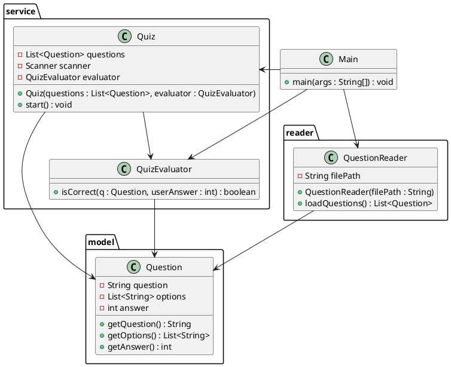

# Les fichiers json

Pour gérer les fichiers json, il existe quantité de Bibliothèque. 
L'une des plus simple des plus populaires et Jackson.

### Installation

Comme il s'agit d'une bibliothèque externe, il faut utiliser un outil tel que Maven pour l'installer.

```xml
<!-- dans pom.xml -->
<dependency>
  <groupId>com.fasterxml.jackson.core</groupId>
  <artifactId>jackson-databind</artifactId>
  <version>2.18.3</version>
</dependency>
```

## Exemple simple d'utilisation

### Écriture d'une classe simple

L'objectif de l'écriture de contenu json et de sérialiser un objet dans ce format particulier. 
Pour cela, il faut instancier un `ObjectMapper` qui sera chargé de cette opération.

**Une classe simple à sérialiser**
```java
// Classe représentant une personne
public class Person {
    public String name;
    public int age;

    // Constructeurs nécessaires pour Jackson
    public Person() {}
    public Person(String name, int age) {
        this.name = name;
        this.age = age;
    }
}
```

**La séralisation**
```java
import com.fasterxml.jackson.databind.ObjectMapper;
import java.io.File;

public class WriteJsonExample {
    public static void main(String[] args) {
        try {
            Person person = new Person("Alice", 30);
            
            ObjectMapper mapper = new ObjectMapper();

            // Écriture dans un fichier JSON
            mapper.writeValue(new File("person.json"), person);
        } catch (Exception e) {
            e.printStackTrace();
        }
    }
}
```

### Lecture d'un contenu json simple

La lecture obéit au même principe.

```java
import com.fasterxml.jackson.databind.ObjectMapper;
import java.io.File;

public class ReadJsonExample {
    public static void main(String[] args) {
        try {
            ObjectMapper mapper = new ObjectMapper();

            // Lecture à partir d’un fichier JSON
            Person person = mapper.readValue(new File("person.json"),
                                             Person.class
            );
            System.out.println("Nom : " + person.name);
            System.out.println("Âge : " + person.age);
        } catch (Exception e) {
            e.printStackTrace();
        }
    }
}
```

>Jackson gère automatiquement les objets imbriqués et même les collections d'objets imbriqués

## Utilisation sans fichier

### Sérialisation et dé-sérialisation dans une variable

Il est possible de sérialiser dans une variable sans enregistrer dans un fichier.
Cette fonction est utile pour enregistrer le contenu dans une base de données par exemple.

```java
Person person = new Person("Alice", 28);
ObjectMapper mapper = new ObjectMapper();
String json = mapper.writeValueAsString(person);
System.out.println(json);
```
De même, il est possible de dé-sérialiser à partir d'une variable.

```java
String json = "{\"name\":\"Alice\",\"age\":28}";
Person person = mapper.readValue(json, Person.class);
```

Et enfin, il est également possible de se passer totalement de classe et de lire le contenu json directement.

```java
JsonNode node = mapper.readTree(new File("person.json"));
String name = node.get("name").asText();
int age = node.get("age").asInt();
```

## Utilisation avec une collection

Plutôt qu'un objet, il est possible de travailler avec une collection telle qu'un Map ou une list.

### Avec un Map

***La structure json**
```json
{
  "name": "Alice",
  "age": 30,
  "address": {
    "city": "Paris",
    "zipcode": "75001"
  }
}

```

#### Écriture de json à partir d'un Map

```java
import com.fasterxml.jackson.databind.ObjectMapper;
import com.fasterxml.jackson.databind.SerializationFeature;

import java.io.File;
import java.util.HashMap;
import java.util.Map;

public class WriteJsonWithMap {
    public static void main(String[] args) throws Exception {
        ObjectMapper mapper = new ObjectMapper();
        mapper.enable(SerializationFeature.INDENT_OUTPUT);

        Map<String, Object> data = new HashMap<>();
        data.put("name", "Alice");
        data.put("age", 30);

        Map<String, String> address = new HashMap<>();
        address.put("city", "Paris");
        address.put("zipcode", "75001");

        data.put("address", address);

        mapper.writeValue(new File("map_output.json"), data);
        System.out.println("JSON écrit avec succès !");
    }
}
```

#### Lecture de json dans un Map

```java
import com.fasterxml.jackson.core.type.TypeReference;
import com.fasterxml.jackson.databind.ObjectMapper;

import java.io.File;
import java.util.Map;

public class ReadJsonWithMap {
    public static void main(String[] args) throws Exception {
        ObjectMapper mapper = new ObjectMapper();

        Map<String, Object> data = mapper.readValue(
            new File("map_output.json"),
            new TypeReference<Map<String, Object>>() {}
        );

        System.out.println("Nom : " + data.get("name"));
        System.out.println("Âge : " + data.get("age"));

        // On doit caster pour accéder à la sous-map
        Map<String, String> address = (Map<String, String>) data.get("address");
        System.out.println("Ville : " + address.get("city"));
        System.out.println("Code postal : " + address.get("zipcode"));
    }
}
```

### Avec une List

**La structure json**

```json
[
  {
    "name": "Alice",
    "age": 30
  },
  {
    "name": "Bob",
    "age": 25
  }
]
```

#### Écriture de contenu json à partir d'une List

```java
import com.fasterxml.jackson.databind.ObjectMapper;
import com.fasterxml.jackson.databind.SerializationFeature;

import java.io.File;
import java.util.*;

public class WriteListOfMaps {
    public static void main(String[] args) throws Exception {
        ObjectMapper mapper = new ObjectMapper();
        mapper.enable(SerializationFeature.INDENT_OUTPUT);

        List<Map<String, Object>> people = new ArrayList<>();

        Map<String, Object> person1 = new HashMap<>();
        person1.put("name", "Alice");
        person1.put("age", 30);

        Map<String, Object> person2 = new HashMap<>();
        person2.put("name", "Bob");
        person2.put("age", 25);

        people.add(person1);
        people.add(person2);

        mapper.writeValue(new File("people_list.json"), people);
        System.out.println("JSON écrit avec succès !");
    }
}
```

#### Lecture de contenu json dans une List

```java
import com.fasterxml.jackson.core.type.TypeReference;
import com.fasterxml.jackson.databind.ObjectMapper;

import java.io.File;
import java.util.*;

public class ReadListOfMaps {
    public static void main(String[] args) throws Exception {
        ObjectMapper mapper = new ObjectMapper();

        List<Map<String, Object>> people = mapper.readValue(
            new File("people_list.json"),
            new TypeReference<List<Map<String, Object>>>() {}
        );

        for (Map<String, Object> person : people) {
            System.out.println("Nom : " + person.get("name"));
            System.out.println("Âge : " + person.get("age"));
            System.out.println("-----");
        }
    }
}
```

Sur le même principe, il est également possible d'utiliser une List d'objets (`List<Person>`).

## Configuration

### Indenter le JSON

```java
mapper.enable(SerializationFeature.INDENT_OUTPUT);
```

### Ignorer les champs inconnus à la lecture

```java
mapper.disable(DeserializationFeature.FAIL_ON_UNKNOWN_PROPERTIES);
```

### Ne pas inclure les champs null

```java
mapper.setSerializationInclusion(JsonInclude.Include.NON_NULL);
```

**Autres options**

- `JsonInclude.Include.NON_EMPTY` : exclut les listes ou chaînes vides

- `JsonInclude.Include.NON_DEFAULT` : exclut les valeurs par défaut

### Formatage des dates

```java
mapper.setDateFormat(new SimpleDateFormat("yyyy-MM-dd"));
```

### Pretty printer

La méthode `mapper.writerWithDefaultPrettyPrinter()` dans Jackson permet de produire un JSON joliment indenté (pretty-printed), ce qui le rend beaucoup plus lisible pour les humains.

```java
mapper.writerWithDefaultPrettyPrinter()
      .writeValue(new File("fichier.json"), person);
```

<!--
## Les annotations

Une partie de la configuration peut être déportée dans la classe sous la forme d'annotations

-->

## Exercices


### Exercice 1 : Sérialisation d'un objet simple

Sérialiser cet objet dans un fichier json

```java
public class Book {
    public String title;
    public String author;
    public int year;

    public Book() {}
    public Book(String title, String author, int year) {
        this.title = title;
        this.author = author;
        this.year = year;
    }
}
```

#### Correction exercice 1 {collapsible="true"}

```java
ObjectMapper mapper = new ObjectMapper();
mapper.enable(SerializationFeature.INDENT_OUTPUT);

Book book = new Book("1984", "George Orwell", 1949);
mapper.writeValue(new File("book.json"), book);
```

### Exercice 2 : Dé-sérialiser une liste

Soit le contenu suivant dans un fichier `books.json`, dé-sérialiser et afficher le contenu dans la console.

```json
[
  { "title": "1984", "author": "George Orwell", "year": 1949 },
  { "title": "Dune", "author": "Frank Herbert", "year": 1965 }
]
```

#### Correction exercice 2 {collapsible="true"}

```java
List<Book> books = mapper.readValue(
    new File("books.json"),
    new TypeReference<List<Book>>() {}
);

for (Book b : books) {
    System.out.println(b.title + " - " + b.author);
}
```

### Exercice 3 : Application Qiz

A partir de la source json suivante, réaliser une application de quiz qui pose des questions et évalue les réponses.

```json
[
  {
    "question": "Quel langage est utilisé pour Android natif ?",
    "options": ["Java", "Kotlin", "C++", "Python"],
    "answer": 1
  },
  {
    "question": "Combien font 5 + 7 ?",
    "options": ["10", "11", "12", "13"],
    "answer": 2
  }
]
```

#### Correction exercice 3 {collapsible="true"}

```java
import com.fasterxml.jackson.core.type.TypeReference;
import com.fasterxml.jackson.databind.ObjectMapper;

import java.io.File;
import java.util.List;
import java.util.Scanner;

// Classe représentant une question du quiz
class Question {
    public String question;
    public List<String> options;
    public int answer;
}

public class QuizApp {
    public static void main(String[] args) {
        try {
            // Lecture du fichier JSON avec Jackson
            ObjectMapper mapper = new ObjectMapper();
            List<Question> questions = mapper.readValue(
                new File("questions.json"),
                new TypeReference<List<Question>>() {}
            );

            Scanner scanner = new Scanner(System.in);
            int score = 0;

            // Parcours des questions
            for (int i = 0; i < questions.size(); i++) {
                Question q = questions.get(i);
                System.out.println("\nQuestion " + (i + 1) + ": " + q.question);

                // Affichage des options
                for (int j = 0; j < q.options.size(); j++) {
                    System.out.println("  " + j + ": " + q.options.get(j));
                }

                // Saisie de la réponse
                System.out.print("Votre réponse (numéro) : ");
                int response = scanner.nextInt();

                // Vérification de la réponse
                if (response == q.answer) {
                    System.out.println("✅ Bonne réponse !");
                    score++;
                } else {
                    System.out.println("Mauvaise réponse !");
                    System.out.println("Réponse correcte : " +
                        q.options.get(q.answer));
                }
            }

            // Score final
            System.out.println("\n=== Résultat final ===");
            System.out.println("Score : " + score + " / " + questions.size());

            scanner.close();
        } catch (Exception e) {
            System.out.println("Erreur : " + e.getMessage());
        }
    }
}

```

### Exercice 4 : Réorganisation du code

Découper le code en plusieurs classes organisées dans des packages selon le diagramme suivant :



#### Correction exercice 4 {collapsible="true"}

**La structure des fichiers**

```
src/
├── Main.java
├── model/
│   └── Question.java
├── reader/
│   └── QuestionReader.java
├── service/
│   ├── Quiz.java
│   └── QuizEvaluator.java
└── questions.json

```

**La classe Question**

```java
package model;

import java.util.List;

// Représente une question du quiz
public class Question {
    private String question;
    private List<String> options;
    private int answer;

    // Getters nécessaires pour Jackson
    public String getQuestion() {
        return question;
    }

    public List<String> getOptions() {
        return options;
    }

    public int getAnswer() {
        return answer;
    }
}
```

**La classe QuestionReader**

```java
package reader;

import model.Question;
import com.fasterxml.jackson.databind.ObjectMapper;
import com.fasterxml.jackson.core.type.TypeReference;

import java.io.File;
import java.util.List;

// Lit les questions depuis un fichier JSON
public class QuestionReader {
    private final String filePath;

    public QuestionReader(String filePath) {
        this.filePath = filePath;
    }

    public List<Question> loadQuestions() throws Exception {
        ObjectMapper mapper = new ObjectMapper();
        return mapper.readValue(
            new File(filePath),
            new TypeReference<List<Question>>() {}
        );
    }
}
```

**La classe Quiz**

```java
package service;

import model.Question;

import java.util.List;
import java.util.Scanner;

// Gère le déroulement du quiz
public class Quiz {
    private final List<Question> questions;
    private final Scanner scanner;
    private final QuizEvaluator evaluator;

    public Quiz(List<Question> questions, QuizEvaluator evaluator) {
        this.questions = questions;
        this.scanner = new Scanner(System.in);
        this.evaluator = evaluator;
    }

    public void start() {
        int score = 0;

        for (int i = 0; i < questions.size(); i++) {
            Question q = questions.get(i);
            System.out.println("\nQuestion " + (i + 1) + ": " + q.getQuestion());

            for (int j = 0; j < q.getOptions().size(); j++) {
                System.out.println("  " + j + ": " + q.getOptions().get(j));
            }

            System.out.print("Votre réponse (numéro) : ");
            int response = scanner.nextInt();

            if (evaluator.isCorrect(q, response)) {
                System.out.println("Bonne réponse !");
                score++;
            } else {
                System.out.println("auvaise réponse !");
                System.out.println("Réponse correcte : " +
                    q.getOptions().get(q.getAnswer()));
            }
        }

        System.out.println("\nScore final : " + score + " / " + questions.size());
    }
}
```

**La classe QuizEvaluator**

```java
package service;

import model.Question;

// Évalue une réponse donnée
public class QuizEvaluator {
    public boolean isCorrect(Question question, int userAnswer) {
        return question.getAnswer() == userAnswer;
    }
}
```

**La classe Main**

```java
import model.Question;
import reader.QuestionReader;
import service.Quiz;
import service.QuizEvaluator;

import java.util.List;

// Point d'entrée de l'application
public class Main {
    public static void main(String[] args) {
        try {
            QuestionReader reader = new QuestionReader("questions.json");
            List<Question> questions = reader.loadQuestions();

            QuizEvaluator evaluator = new QuizEvaluator();
            Quiz quiz = new Quiz(questions, evaluator);
            quiz.start();

        } catch (Exception e) {
            System.out.println("Erreur : " + e.getMessage());
        }
    }
}
```

**Le fichier pom.xml**

```xml
<project xmlns="http://maven.apache.org/POM/4.0.0"
         xmlns:xsi="http://www.w3.org/2001/XMLSchema-instance"
         xsi:schemaLocation="http://maven.apache.org/POM/4.0.0 
                             http://maven.apache.org/xsd/maven-4.0.0.xsd">

  <modelVersion>4.0.0</modelVersion>

  <groupId>fr.formation</groupId>
  <artifactId>quizapp</artifactId>
  <version>1.0</version>
  <packaging>jar</packaging>

  <name>QuizApp</name>

  <properties>
    <maven.compiler.source>23</maven.compiler.source>
    <maven.compiler.target>23</maven.compiler.target>
    <project.build.sourceEncoding>UTF-8</project.build.sourceEncoding>
  </properties>

  <dependencies>
    <!-- Jackson core et databind (dernière version) -->
    <dependency>
      <groupId>com.fasterxml.jackson.core</groupId>
      <artifactId>jackson-databind</artifactId>
      <version>2.17.0</version>
    </dependency>
  </dependencies>

  <build>
    <plugins>
      <!-- Compiler plugin -->
      <plugin>
        <groupId>org.apache.maven.plugins</groupId>
        <artifactId>maven-compiler-plugin</artifactId>
        <version>3.11.0</version>
      </plugin>

      <!-- Plugin Shade pour produire un fat JAR -->
      <plugin>
        <groupId>org.apache.maven.plugins</groupId>
        <artifactId>maven-shade-plugin</artifactId>
        <version>3.5.1</version>
        <executions>
          <execution>
            <phase>package</phase>
            <goals><goal>shade</goal></goals>
            <configuration>
              <transformers>
                <transformer implementation="org.apache.maven.plugins.shade.resource.ManifestResourceTransformer">
                  <mainClass>Main</mainClass> 
                </transformer>
              </transformers>
            </configuration>
          </execution>
        </executions>
      </plugin>
    </plugins>
  </build>

</project>

```


