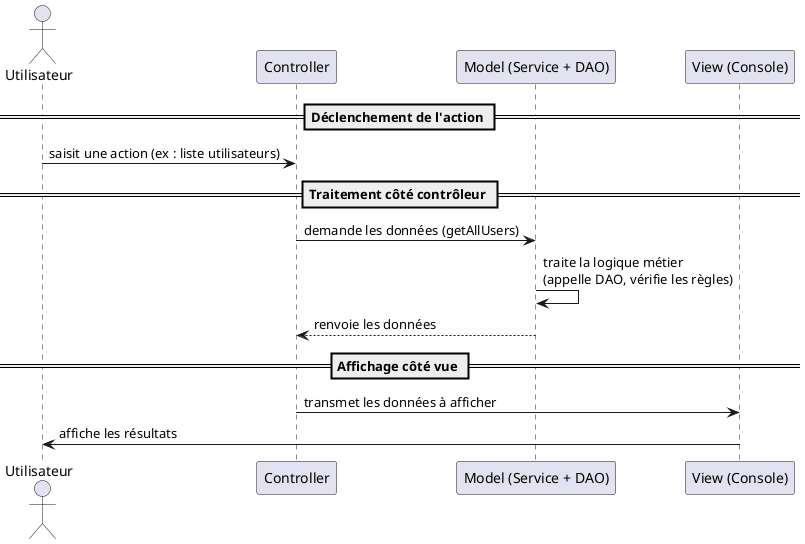

# Le pattern MVC

Le pattern MVC est une architecture logicielle qui permet de séparer les responsabilités d’une application en trois
parties distinctes :

| Composant      | Rôle principal                                                                    | Exemple                                                        |
|----------------|-----------------------------------------------------------------------------------|----------------------------------------------------------------|
| **Model**      | Représente les **données** et la logique métier                                   | Une classe `User`, ou une base de données d'utilisateurs       |
| **View**       | Gère l’**interface utilisateur** (affichage, entrées)                             | Affiche une liste d'utilisateurs dans le terminal              |
| **Controller** | Reçoit les **commandes de l’utilisateur**, appelle le Model et met à jour la View | Un menu qui appelle un service pour récupérer les utilisateurs |

Il est possible et fréquent de découper chaque partie en unités distinctes ce qui est fréquent pour la couche Model.

**Pourquoi utiliser MVC ?**

- Séparation des responsabilités : chaque classe a un rôle bien défini

- Facilité de maintenance : les composants sont découplés

- Réutilisabilité & testabilité : on peut tester la logique métier sans interface

### Fonctionnement



## Proposition de structure MVC

### Structure du projet

```
src/
└── main/
    └── java/
        └── fr/
            └── mvc/
                ├── app/
                │   ├── Main.java
                │   ├── Router.java
                │   └── ServiceLocator.java
                │
                ├── controller/
                │   ├── UserController.java
                │   └── ProductController.java
                │
                ├── view/
                │   ├── UserView.java
                │   └── ProductView.java
                │
                └── model/
                    ├── entity/
                    │   ├── User.java
                    │   └── Product.java
                    │
                    ├── service/
                    │   ├── UserService.java
                    │   └── ProductService.java
                    │
                    └── dao/
                        ├── UserDao.java
                        └── ProductDao.java
```

### La classe Main

```java
package fr.mvc.app;

import java.util.Scanner;

public class Main {
    public static void main(String[] args) {
        Scanner scanner = new Scanner(System.in);
        Router router = new Router(scanner);
        router.start();
        scanner.close();
    }
}

```

### Le routeur

```java
package fr.mvc.app;

import java.util.Scanner;
import fr.mvc.app.controller.UserController;
import fr.mvc.app.model.service.UserService;
import fr.mvc.app.view.UserView;

public class Router {
    private final Scanner scanner;
    private final UserController userController;

    public Router(Scanner scanner) {
        this.scanner = scanner;
        UserService userService = new UserService();
        UserView userView = new UserView(scanner);
        this.userController = new UserController(scanner, userService, userView);
    }

    public void start() {
        while (true) {
            System.out.println("=== Menu Principal ===");
            System.out.println("1. Liste des utilisateurs");
            System.out.println("0. Quitter");
            System.out.print("Choix : ");
            String input = scanner.nextLine();

            switch (input) {
                case "1":
                    userController.showAllUsers();
                    break;
                case "0":
                    System.out.println("À bientôt !");
                    return;
                default:
                    System.out.println("Option invalide.");
            }
        }
    }
}
```

### Le contrôleur

```java
package fr.mvc.app.controller;

import java.util.Scanner;
import fr.mvc.app.model.service.UserService;
import fr.mvc.app.view.UserView;
import fr.mvc.app.model.entity.User;

public class UserController {
    private final Scanner scanner;
    private final UserService userService;
    private final UserView userView;

    public UserController(
        Scanner scanner,
        UserService userService,
        UserView userView
    ) {
        this.scanner = scanner;
        this.userService = userService;
        this.userView = userView;
    }

    public void showAllUsers() {
        User[] users = userService.getAllUsers();
        userView.displayUsers(users);
    }
}
```
### L'entité

```java
package fr.mvc.app.model.entity;

public class User {
    private final int id;
    private final String name;

    public User(int id, String name) {
        this.id = id;
        this.name = name;
    }

    public int getId() { return id; }

    public String getName() { return name; }
}

```

### Le service

```java
package fr.mvc.app.model.service;

import fr.mvc.app.model.entity.User;

public class UserService {
    public User[] getAllUsers() {
        return new User[] {
            new User(1, "Alice"),
            new User(2, "Bob"),
            new User(3, "Charlie")
        };
    }
}

```

### La vue

```java
package fr.mvc.app.view;

import java.util.Scanner;
import fr.mvc.app.model.entity.User;

public class UserView {
    private final Scanner scanner;

    public UserView(Scanner scanner) {
        this.scanner = scanner;
    }

    public void displayUsers(User[] users) {
        System.out.println("--- Liste des utilisateurs ---");
        for (User user : users) {
            System.out.println(user.getId() + " - " + user.getName());
        }
    }
}
```


## ServiceLocator

Le routeur possède deux responsabilités, aiguiller la requête et instancier les classes. Il est possible de découper ces deux responsabilités en ajoutant une classe `ServiceLocator` qui sera chargée de l'instanciation.

Service Locator est un pattern de conception qui sert à centraliser l'accès aux services dans une application. 
Il peut simplifier la gestion des dépendances, notamment dans des projets Java simples qui n'utilisent pas de système d'injection de dépendances.

**Qu'est-ce qu’un Service Locator ?**

C’est un objet central qui :

- Crée et conserve les instances de services (et autres objets partagés)

- Les fournit aux classes qui en ont besoin

- Évite de répéter les constructions de dépendances dans chaque classe

> En gros : plutôt que de faire new Service() dans chaque classe, on demande au ServiceLocator de nous le fournir.

### Le serviceLocator

```java
package fr.mvc.app;

import java.util.Scanner;
import fr.mvc.app.controller.UserController;
import fr.mvc.app.model.service.UserService;
import fr.mvc.app.view.UserView;

public class ServiceLocator {
    private final Scanner scanner;

    private UserController userController;
    private UserService userService;
    private UserView userView;

    public ServiceLocator(Scanner scanner) {
        this.scanner = scanner;
    }

    public UserController getUserController() {
        if (userController == null) {
            userController = new UserController(scanner, getUserService(), getUserView());
        }
        return userController;
    }

    public UserService getUserService() {
        if (userService == null) {
            userService = new UserService();
        }
        return userService;
    }

    public UserView getUserView() {
        if (userView == null) {
            userView = new UserView(scanner);
        }
        return userView;
    }
}
```

### Modification du routeur

```java
package fr.mvc.app;

import java.util.Scanner;
import fr.mvc.app.controller.UserController;

public class Router {
    private final Scanner scanner;
    private final ServiceLocator locator;

    public Router(Scanner scanner) {
        this.scanner = scanner;
        this.locator = new ServiceLocator(scanner);
    }

    public void start() {
        while (true) {
            System.out.println("=== Menu Principal ===");
            System.out.println("1. Liste des utilisateurs");
            System.out.println("0. Quitter");
            System.out.print("Choix : ");
            String input = scanner.nextLine();

            switch (input) {
                case "1":
                    locator.getUserController().showAllUsers();
                    break;
                case "0":
                    System.out.println("À bientôt !");
                    return;
                default:
                    System.out.println("Option invalide.");
            }
        }
    }
}
```

## Exercice

Ajouter la gestion des produits à cette petite application

