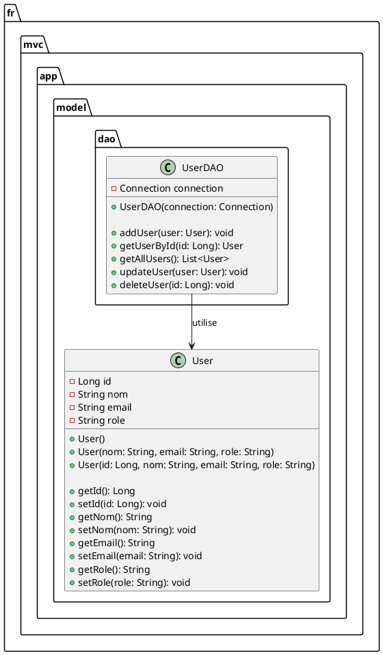

# Le pattern DAO

DAO (pour Data Access Object) est un design pattern très courant en Java (et dans d'autres langages) qui sert à isoler la logique d’accès aux données de la logique métier (le cœur de l’application)

**Rôle du DAO**

- Accéder aux données dans la base de données (lire, insérer, mettre à jour, supprimer).

- Masquer les détails techniques d'accès aux données (SQL, JDBC, etc.).

- Fournir une interface propre pour manipuler des objets métier (User, Produit, etc.).

- Centraliser les requêtes liées à une entité (par exemple UserDAO s’occupe uniquement des utilisateurs).

**Avantages du DAO**

| Avantage                           | Explication                                                                                  |
|------------------------------------|----------------------------------------------------------------------------------------------|
| **Séparation des responsabilités** | Le code métier (ex : calculer un prix, vérifier un rôle) ne s’occupe **pas du SQL**.         |
| **Lisibilité du code**             | Le code est plus clair et organisé. Chaque DAO gère **une seule entité**.                    |
| **Réutilisabilité**                | Le DAO peut être utilisé dans plusieurs services, sans dupliquer les requêtes SQL.           |
| **Facilité de maintenance**        | Si la structure de la base ou les requêtes changent, on modifie uniquement le DAO.           |
| **Testabilité**                    | On peut **mock** le DAO pour tester la logique métier sans base de données réelle.           |
| **Évolutivité**                    | Il est plus facile de passer de JDBC à JPA, ou à une base NoSQL, en ne modifiant que le DAO. |


## DAO Spécifique



### Le code

#### La table

```sql
CREATE TABLE user (
    id INT UNSIGNED AUTO_INCREMENT PRIMARY KEY,
    nom VARCHAR(50) NOT NULL,
    email VARCHAR(50) NOT NULL UNIQUE,
    role VARCHAR(20) NOT NULL
);

```

#### L'entité

```java
package fr.mvc.app.model;

public class User {

    private Long id;
    private String name;
    private String email;
    private String role;

    // Constructeurs
    public User() {}

    public User(String name, String email, String role) {
        this.name = name;
        this.email = email;
        this.role = role;
    }

    public User(Long id, String name, String email, String role) {
        this.id = id;
        this.name = name;
        this.email = email;
        this.role = role;
    }

    // Getters et setters
    public Long getId() {
        return id;
    }

    public void setId(Long id) {
        this.id = id;
    }

    public String getName() {
        return name;
    }

    public void setName(String name) {
        this.name = name;
    }

    public String getEmail() {
        return email;
    }

    public void setEmail(String email) {
        this.email = email;
    }

    public String getRole() {
        return role;
    }

    public void setRole(String role) {
        this.role = role;
    }
}
```

#### La classe DAO

```java
package fr.mvc.app.model.dao;

import fr.mvc.app.model.User;

import java.sql.*;
import java.util.ArrayList;
import java.util.List;

public class UserDAO {

    private Connection connection;

    // Constructeur avec connexion JDBC
    public UserDAO(Connection connection) {
        this.connection = connection;
    }

    // Ajouter un utilisateur
    public void addUser(User user) throws SQLException {
        String sql = "INSERT INTO user (name, email, role) VALUES (?, ?, ?)";
        try (PreparedStatement stmt = connection.prepareStatement(sql)) {
            stmt.setString(1, user.getName());
            stmt.setString(2, user.getEmail());
            stmt.setString(3, user.getRole());
            stmt.executeUpdate();
        }
    }

    // Récupérer un utilisateur par ID
    public User getUserById(Long id) throws SQLException {
        String sql = "SELECT * FROM user WHERE id = ?";
        try (PreparedStatement stmt = connection.prepareStatement(sql)) {
            stmt.setLong(1, id);
            ResultSet rs = stmt.executeQuery();

            if (rs.next()) {
                return new User(
                    rs.getLong("id"),
                    rs.getString("name"),
                    rs.getString("email"),
                    rs.getString("role")
                );
            }
            return null;
        }
    }
}

```
### Exercice

Implémenter les méthodes manquantes du DAO

#### Correction {collapsible="true"}

```java
package fr.mvc.app.model.dao;;

import fr.mvc.app.model.User;

import java.sql.*;
import java.util.ArrayList;
import java.util.List;

public class UserDAO {

    private Connection connection;

    // Constructeur avec connexion JDBC
    public UserDAO(Connection connection) {
        this.connection = connection;
    }

    // Ajouter un utilisateur
    public void addUser(User user) throws SQLException {
        String sql = "INSERT INTO user (name, email, role) VALUES (?, ?, ?)";
        try (PreparedStatement stmt = connection.prepareStatement(sql)) {
            stmt.setString(1, user.getName());
            stmt.setString(2, user.getEmail());
            stmt.setString(3, user.getRole());
            stmt.executeUpdate();
        }
    }

    // Récupérer un utilisateur par ID
    public User getUserById(Long id) throws SQLException {
        String sql = "SELECT * FROM user WHERE id = ?";
        try (PreparedStatement stmt = connection.prepareStatement(sql)) {
            stmt.setLong(1, id);
            ResultSet rs = stmt.executeQuery();

            if (rs.next()) {
                return new User(
                    rs.getLong("id"),
                    rs.getString("name"),
                    rs.getString("email"),
                    rs.getString("role")
                );
            }
            return null;
        }
    }

    // Récupérer tous les utilisateurs
    public List<User> getAllUsers() throws SQLException {
        String sql = "SELECT * FROM user";
        List<User> users = new ArrayList<>();

        try (Statement stmt = connection.createStatement()) {
            ResultSet rs = stmt.executeQuery(sql);

            while (rs.next()) {
                users.add(new User(
                    rs.getLong("id"),
                    rs.getString("name"),
                    rs.getString("email"),
                    rs.getString("role")
                ));
            }
        }
        return users;
    }

    // Mettre à jour un utilisateur
    public void updateUser(User user) throws SQLException {
        String sql = "UPDATE user SET name = ?, email = ?, role = ? WHERE id = ?";
        try (PreparedStatement stmt = connection.prepareStatement(sql)) {
            stmt.setString(1, user.getName());
            stmt.setString(2, user.getEmail());
            stmt.setString(3, user.getRole());
            stmt.setLong(4, user.getId());
            stmt.executeUpdate();
        }
    }

    // Supprimer un utilisateur
    public void deleteUser(Long id) throws SQLException {
        String sql = "DELETE FROM user WHERE id = ?";
        try (PreparedStatement stmt = connection.prepareStatement(sql)) {
            stmt.setLong(1, id);
            stmt.executeUpdate();
        }
    }
}

```


## DAO générique, première approche

Cette première approche est intéressante, mais l'impose de dupliquer beaucoup de code, lorsque le projet contient plusieurs tables. Une approche plus générique pourrait factoriser une partie de ce code.

### Une interface générique

```java
package fr.mvc.app.model.dao;

import java.sql.SQLException;
import java.util.List;

/**
 * Interface générique définissant les opérations CRUD de base.
 */
public interface GenericDAO<T> {

    void add(T entity) throws SQLException;

    T getById(Long id) throws SQLException;

    List<T> getAll() throws SQLException;

    void update(T entity) throws SQLException;

    void delete(Long id) throws SQLException;
}
```

### Une classe abstraite

La classe abstraite factorise les opérations qui sont similaires pour toutes les tables.

```java
package fr.mvc.app.model.dao;

import java.sql.*;
import java.util.ArrayList;
import java.util.List;

/**
 * Classe abstraite générique implémentant les opérations
 * génériques de lecture et suppression via JDBC.
 * L'insertion et la mise à jour sont spécifiques à chaque entité.
 */
public abstract class AbstractDAO<T> implements GenericDAO<T> {

    protected Connection connection;

    public AbstractDAO(Connection connection) {
        this.connection = connection;
    }

    // Nom de la table associée à l'entité
    protected abstract String getTableName();

    // Méthode de mappage d'une ligne de résultat vers un objet
    protected abstract T mapResultSet(ResultSet rs) throws SQLException;

    // Récupérer une entité par son ID
    @Override
    public T getById(Long id) throws SQLException {
        String sql = "SELECT * FROM " + getTableName() + " WHERE id = ?";
        try (PreparedStatement stmt = connection.prepareStatement(sql)) {
            stmt.setLong(1, id);
            ResultSet rs = stmt.executeQuery();
            if (rs.next()) {
                return mapResultSet(rs);
            }
            return null;
        }
    }

    // Récupérer toutes les entités
    @Override
    public List<T> getAll() throws SQLException {
        String sql = "SELECT * FROM " + getTableName();
        List<T> list = new ArrayList<>();

        try (Statement stmt = connection.createStatement()) {
            ResultSet rs = stmt.executeQuery(sql);
            while (rs.next()) {
                list.add(mapResultSet(rs));
            }
        }

        return list;
    }

    // Supprimer une entité par son ID
    @Override
    public void delete(Long id) throws SQLException {
        String sql = "DELETE FROM " + getTableName() + " WHERE id = ?";
        try (PreparedStatement stmt = connection.prepareStatement(sql)) {
            stmt.setLong(1, id);
            stmt.executeUpdate();
        }
    }

    // Les méthodes add() et update() sont spécifiques à chaque entité
    // Méthode abstraite pour insérer une entité
    @Override
    public abstract void add(T entity) throws SQLException;

    // Méthode abstraite pour mettre à jour une entité
    @Override
    public abstract void update(T entity) throws SQLException;

}

```

### Une classe concrète pour gérer les spécificités

```java
package fr.mvc.app.model.dao;

import fr.mvc.app.model.User;

import java.sql.*;

/**
 * Implémentation DAO spécifique à l'entité User.
 * Elle hérite des opérations génériques et implémente
 * les opérations propres à User.
 */
public class UserDAO extends AbstractDAO<User> {

    public UserDAO(Connection connection) {
        super(connection);
    }

    // Nom de la table associée
    @Override
    protected String getTableName() {
        return "user";
    }

    // Convertir une ligne de résultat SQL en objet User
    @Override
    protected User mapResultSet(ResultSet rs) throws SQLException {
        return new User(
            rs.getLong("id"),
            rs.getString("nom"),
            rs.getString("email"),
            rs.getString("role")
        );
    }

    // Ajouter un utilisateur dans la base
    @Override
    public void add(User user) throws SQLException {
        String sql = "INSERT INTO user (nom, email, role) VALUES (?, ?, ?)";
        try (PreparedStatement stmt = connection.prepareStatement(sql)) {
            stmt.setString(1, user.getNom());
            stmt.setString(2, user.getEmail());
            stmt.setString(3, user.getRole());
            stmt.executeUpdate();
        }
    }

    // Mettre à jour les données d'un utilisateur
    @Override
    public void update(User user) throws SQLException {
        String sql = "UPDATE user SET nom = ?, email = ?, role = ? WHERE id = ?";
        try (PreparedStatement stmt = connection.prepareStatement(sql)) {
            stmt.setString(1, user.getNom());
            stmt.setString(2, user.getEmail());
            stmt.setString(3, user.getRole());
            stmt.setLong(4, user.getId());
            stmt.executeUpdate();
        }
    }
}

```

## DAO très générique utilisant l'introspection

```java
package fr.mvc.app.model.dao;

import java.lang.reflect.*;
import java.sql.*;
import java.util.*;

/**
 * DAO générique utilisant l'introspection (réflexion) pour
 * gérer automatiquement les opérations CRUD de n'importe
 * quelle entité Java dont les champs correspondent aux colonnes
 * de la base de données.
 *
 * Conditions :
 * - L'entité doit avoir un champ 'id' (clé primaire) de type Long
 * - Les noms des attributs doivent correspondre aux noms des colonnes
 * - L'entité doit avoir un constructeur par défaut
 */
public class GenericReflectiveDAO<T> {

    private final Connection connection;
    private final Class<T> entityClass;
    private final String tableName;

    /**
     * Constructeur générique
     *
     * @param connection Connexion JDBC active
     * @param entityClass      Classe de l'entité (ex: User.class)
     * @param tableName  Nom de la table SQL associée à l'entité
     */
    public GenericReflectiveDAO(Connection connection, Class<T> entityClass,
                                String tableName) {
        this.connection = connection;
        this.entityClass = entityClass;
        this.tableName = tableName;
    }

    /**
     * Insère une entité dans la base (sauf le champ 'id' auto-généré)
     */
    public void add(T entity) throws SQLException {
        Field[] fields = getNonIdFields();

        String columns = String.join(", ", getFieldNames(fields));
        String placeholders = String.join(", ", Collections.nCopies(fields.length, "?"));
        String sql = "INSERT INTO " + tableName + " (" + columns + ") VALUES (" + placeholders + ")";

        try (PreparedStatement stmt = connection.prepareStatement(sql)) {
            setFieldValues(stmt, entity, fields);
            stmt.executeUpdate();
        }
    }

    /**
     * Récupère une entité à partir de son identifiant
     */
    public T getById(Long id) throws SQLException {
        String sql = "SELECT * FROM " + tableName + " WHERE id = ?";
        try (PreparedStatement stmt = connection.prepareStatement(sql)) {
            stmt.setLong(1, id);
            ResultSet rs = stmt.executeQuery();
            if (rs.next()) {
                return mapResultSetToEntity(rs);
            }
        }
        return null;
    }

    /**
     * Récupère toutes les entités présentes dans la table
     */
    public List<T> getAll() throws SQLException {
        List<T> list = new ArrayList<>();
        String sql = "SELECT * FROM " + tableName;

        try (Statement stmt = connection.createStatement();
             ResultSet rs = stmt.executeQuery(sql)) {
            while (rs.next()) {
                list.add(mapResultSetToEntity(rs));
            }
        }

        return list;
    }

    /**
     * Met à jour une entité existante en base à partir de son id
     */
    public void update(T entity) throws SQLException {
        Field[] fields = getNonIdFields();
        String setClause = String.join(", ",
            Arrays.stream(fields).map(f -> f.getName() + " = ?").toList());

        String sql = "UPDATE " + tableName + " SET " + setClause + " WHERE id = ?";

        try (PreparedStatement stmt = connection.prepareStatement(sql)) {
            // Affecte les nouvelles valeurs
            setFieldValues(stmt, entity, fields);

            // Récupère la valeur du champ 'id'
            Field idField = entityClass.getDeclaredField("id");
            idField.setAccessible(true);
            stmt.setObject(fields.length + 1, idField.get(entity));

            stmt.executeUpdate();
        } catch (NoSuchFieldException | IllegalAccessException e) {
            throw new SQLException("Erreur de réflexion lors de l'update", e);
        }
    }

    /**
     * Supprime une entité en base à partir de son identifiant
     */
    public void delete(Long id) throws SQLException {
        String sql = "DELETE FROM " + tableName + " WHERE id = ?";
        try (PreparedStatement stmt = connection.prepareStatement(sql)) {
            stmt.setLong(1, id);
            stmt.executeUpdate();
        }
    }

    // ──────────────────────────────────────────────
    // MÉTHODES UTILITAIRES D’INTROSPECTION
    // ──────────────────────────────────────────────

    /**
     * Retourne tous les champs sauf 'id'
     */
    private Field[] getNonIdFields() {
        return Arrays.stream(entityClass.getDeclaredFields())
            .filter(f -> !f.getName().equalsIgnoreCase("id"))
            .toArray(Field[]::new);
    }

    /**
     * Récupère les noms de champs sous forme de liste
     */
    private List<String> getFieldNames(Field[] fields) {
        return Arrays.stream(fields).map(Field::getName).toList();
    }

    /**
     * Affecte dynamiquement les valeurs de l'objet aux paramètres SQL
     */
    private void setFieldValues(PreparedStatement stmt, T entity,
                                Field[] fields) throws SQLException {
        try {
            for (int i = 0; i < fields.length; i++) {
                fields[i].setAccessible(true); // pour accéder aux champs privés
                stmt.setObject(i + 1, fields[i].get(entity));
            }
        } catch (IllegalAccessException e) {
            throw new SQLException("Erreur lors de la lecture des champs", e);
        }
    }

    /**
     * Construit dynamiquement un objet T à partir d’un ResultSet
     */
    private T mapResultSetToEntity(ResultSet rs) throws SQLException {
        try {
            T obj = entityClass.getDeclaredConstructor().newInstance();

            for (Field field : entityClass.getDeclaredFields()) {
                field.setAccessible(true);
                Object value = rs.getObject(field.getName());
                field.set(obj, value);
            }

            return obj;
        } catch (Exception e) {
            throw new SQLException("Erreur lors du mapping ResultSet", e);
        }
    }
}

```

### Utilisation du DAO générique

```java
package fr.mvc.app;

import fr.mvc.app.model.User;
import fr.mvc.app.model.dao.GenericReflectiveDAO;

import java.sql.Connection;
import java.sql.DriverManager;
import java.util.List;

public class Main {

    public static void main(String[] args) {
        // Informations de connexion à MariaDB
        String url = "jdbc:mariadb://localhost:3306/ma_base";
        String user = "root";
        String password = "mon_mdp";

        try (Connection conn = DriverManager.getConnection(url, user, password)) {

            // Instanciation du DAO générique pour User
            GenericReflectiveDAO<User> userDao =
                new GenericReflectiveDAO<>(conn, User.class, "user");

            // Création d'un nouvel utilisateur
            User alice = new User("Alice Dupont", "alice@mail.com", "admin");
            userDao.add(alice);
            System.out.println("Utilisateur ajouté.");

            // Liste de tous les utilisateurs
            List<User> users = userDao.getAll();
            System.out.println("Tous les utilisateurs :");
            users.forEach(System.out::println);

            // Mise à jour du premier utilisateur
            if (!users.isEmpty()) {
                User first = users.get(0);
                first.setRole("superadmin");
                userDao.update(first);
                System.out.println("Utilisateur mis à jour.");
            }

            // Suppression du premier utilisateur
            if (!users.isEmpty()) {
                userDao.delete(users.get(0).getId());
                System.out.println("🗑️ Utilisateur supprimé.");
            }

        } catch (Exception e) {
            System.err.println("Erreur : " + e.getMessage());
            e.printStackTrace();
        }
    }
}
```

### Conclusion

L'approche est intéressante et factorise une grande partie du code redondant. 
Pour des projets simples de gestion de la persistance, le dao générique peut parfaitement convenir.
Toutefois, si les besoins deviennent plus complexes, il sera plus raisonnable de se doter d'un véritable composant ORM. 


