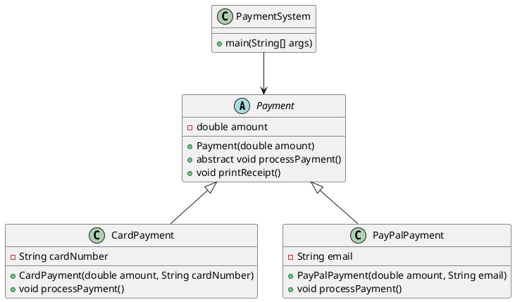
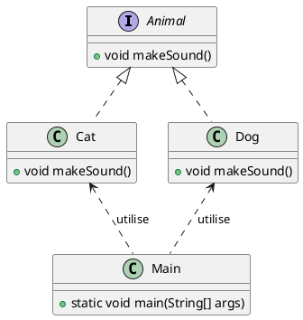

# La POO

La Programmation Orientée Objet (POO) est un paradigme de programmation qui permet de modéliser des entités du monde réel sous forme d'objets. Java est un langage fortement basé sur la POO, ce qui signifie que tout y repose sur le concept d'objets et de classes.

La POO repose sur quatre piliers :

- Encapsulation
- Héritage
- Polymorphisme
- Abstraction

## Classes et Objets : Les Briques de Base

Un objet est une instance d'une classe. Cela signifie qu’on peut créer plusieurs objets à partir d’un même modèle.

```java
public class Main {
    public static void main(String[] args) {
        // Création d'un objet Car
        Car myCar = new Car();
        
        // Affectation de la marque
        myCar.brand = "Toyota";  
        
        // Affectation de la vitesse
        myCar.speed = 120;       

        // Appel de la méthode displayInfo()
        
        // Affiche : Marque: Toyota, Vitesse: 120 km/h
        myCar.displayInfo();  
    }
}
```

## Encapsulation : Protéger les Données

**Pourquoi l’encapsulation est-elle importante ?**

- Empêcher l’accès direct aux données.
- Forcer l’utilisation de méthodes pour lire/modifier les données.
- Assurer la cohérence des données.

```java
public class Car {

    // Attribut privé
    private String brand;  
    private int speed;

    // Constructeur (permet d'initialiser un objet)
    public Car(String brand, int speed) {
        this.brand = brand;
        this.speed = speed;
    }

    // Getter : permet d'accéder à l'attribut
    public String getBrand() {
        return brand;
    }

    // Setter : permet de modifier l'attribut
    public void setBrand(String brand) {
        this.brand = brand;
    }

    // Méthode pour afficher les infos
    public void displayInfo() {
        // this est optionnel 
        // sauf s'il existe une variable locale du même nom
        System.out.println(
            "Marque: " + brand + ", Vitesse: " + speed + " km/h"
        );
    }
}
```
- L'initialisation de l'objet s'effectue avec un constructeur, il s'agit d'une méthode **qui porte le nom de la classe**.
- On déclare les attributs en private (inaccessibles directement).
- On fournit des méthodes getBrand() et setBrand() pour accéder aux valeurs.

## Héritage : Réutiliser le Code

**Pourquoi utiliser l’héritage ?**
- Réduction du code redondant → évite de réécrire du code déjà existant.
- Facilite la maintenance → une modification dans la classe parent se répercute sur les sous-classes.

```java
// Classe parente (superclasse)
public class Vehicle {
    protected String brand;
    
    // Constructeur
    public Vehicle(String brand){
        this.brand = brand;
    }

    public void start() {
        System.out.println(brand + " démarre !");
    }
}

// Classe enfant (sous-classe)
public class Car extends Vehicle {
    protected int doors;
    
    // Constructeur
    public Car(String brand, int doors){
        
        // appel du constructeur du parent
        super(brand);
        
        this.doors = doors;
    }

    public void displayInfo() {
        System.out.println("Marque: " + brand + ", Portes: " + doors);
    }
}

// Utilisation de l’héritage
public class Main {
    public static void main(String[] args) {
        Car myCar = new Car("Toyota", 4);

        myCar.start();  // Toyota démarre !
        myCar.displayInfo();  // Marque: Toyota, Portes: 4
    }
}

```

## Polymorphisme : Adapter le Comportement

**Deux types de polymorphisme en Java**
- Surcharge (overloading) → Plusieurs méthodes avec le même nom, mais des paramètres différents.
- Redéfinition (overriding) → Une sous-classe remplace une méthode de la superclasse.

### Exemple de surcharge

```java
public class MathUtils {
    // Addition d'entiers
    public int add(int a, int b) {
        return a + b;
    }

    // Addition de nombres flottants
    public double add(double a, double b) {
        return a + b;
    }
}
```

### Exemple de redéfinition

```java
// Classe parente
public class Animal {
    public void makeSound() {
        System.out.println("L'animal fait un bruit.");
    }
}

// Classe enfant redéfinissant la méthode
public class Dog extends Animal {
    @Override
    public void makeSound() {
        System.out.println("Le chien aboie !");
    }
}

```

**Surcharge du constructeur**

```java

public class Person {
    private String firstName;
    private String lastName;
    
    Person (){}
    
    Person(String lastName){
        this.lastName = lastName;
    }
    
    Person(String fistName, String lastName){
        this.firstName = firstName;
        this.lastName = lastName;
    }

}

```

## Les classes abstraites

Une classe abstraite en Java est une classe qui ne peut pas être instanciée directement et qui peut contenir des méthodes abstraites (sans implémentation) ainsi que des méthodes concrètes (avec implémentation). Elle sert de modèle pour les sous-classes qui doivent implémenter les méthodes abstraites.

### Pourquoi utiliser une classe abstraite ?

- Éviter la redondance du code en regroupant des comportements communs.
- Encapsuler une structure commune tout en laissant la flexibilité aux sous-classes.
- Forcer certaines classes à implémenter des méthodes spécifiques.

### Exemple : Un système de paiement



#### La classe abstraite

```java
abstract class Payment {
    protected double amount;

    public Payment(double amount) {
        this.amount = amount;
    }

    // Méthode abstraite pour forcer l'implémentation du paiement
    public abstract void processPayment();

    // Méthode concrète commune
    public void printReceipt() {
        System.out.println("Reçu : paiement de " + amount + " €");
    }
}
```

#### Paiement par carte

```java
class CardPayment extends Payment {
    private String cardNumber;

    public CardPayment(double amount, String cardNumber) {
        super(amount);
        this.cardNumber = cardNumber;
    }

    @Override
    public void processPayment() {
        System.out.println(
            "Paiement de " + amount + " € par carte (" 
            + cardNumber + ") validé."
        );
    }
}
```

#### Paiement avec PayPal

```java
class PayPalPayment extends Payment {
    private String email;

    public PayPalPayment(double amount, String email) {
        super(amount);
        this.email = email;
    }

    @Override
    public void processPayment() {
        System.out.println("Paiement de " + amount + " € via PayPal (" + email + ") validé.");
    }
}
```

#### Utilisation des classes

```java
public class PaymentSystem {
    public static void main(String[] args) {
    
        Payment card = new CardPayment(50.0, "1234-5678-9012-3456");
        Payment paypal = new PayPalPayment(30.0, "client@email.com");

        card.processPayment();
        card.printReceipt();

        paypal.processPayment();
        paypal.printReceipt();
    }
}
```

### Conclusion

Les classes abstraites sont parfaites lorsqu’on veut définir un modèle de base avec une implémentation partielle et forcer les sous-classes à implémenter certaines méthodes. Elles sont très utiles pour structurer le code et éviter la duplication.

## Les interfaces

Une interface est une structure qui définit un contrat que les classes doivent respecter. Elle ne contient que des méthodes abstraites (sans implémentation) et des constantes (attributs `public static final`).

Depuis Java 8, une interface peut également contenir des méthodes par défaut et des méthodes statiques.

### Un exemple simple



```Java
// Définition de l'interface
interface Animal {
    void makeSound(); // Méthode abstraite
}

// Classe qui implémente l'interface
class Dog implements Animal {
    public void makeSound() {
        System.out.println("Woof! Woof!");
    }
}

// Une autre classe qui implémente l'interface
class Cat implements Animal {
    public void makeSound() {
        System.out.println("Meow! Meow!");
    }
}

// Classe principale
public class Main {
    public static void main(String[] args) {
        Animal myDog = new Dog();
        Animal myCat = new Cat();

        myDog.makeSound(); // Affiche: Woof! Woof!
        myCat.makeSound(); // Affiche: Meow! Meow!
    }
```


## Exercices

### Exercice 1 : Gestion d’une bibliothèque

**Objectif :** Utiliser l'encapsulation et les relations entre classes.

<procedure>
<step>
Créez une classe Book avec les attributs : title, author, isbn, et isBorrowed (booléen).
</step>

<step>
Implémentez des méthodes pour :

- Emprunter un livre(`borrowBook()`). 
- rendre un livre (`returnBook()`).
</step>
<step>
Créez une classe Library qui contient une liste de livres et des méthodes pour :

- Ajouter un livre (`addBook(Book book)`).
- Rechercher un livre par son titre (`findBookByTitle(String title)`).
- Afficher tous les livres disponibles.
</step>

</procedure>

### Exercice 2 : Système de gestion d’une boutique en ligne
**Objectif :** Utiliser l'héritage et le polymorphisme.
<procedure>
<step>
Créez une classe Product avec les attributs : 

- name
- price
- quantity
</step>

<step>
Créez deux sous-classes :

- Electronics avec un attribut supplémentaire warrantyPeriod.
- Clothing avec un attribut size.

</step>

<step>
Implémentez une méthode displayDetails() dans Product et surchargez-la dans les sous-classes.
</step>

<step>
Créez une classe ShoppingCart contenant une liste de Product et des méthodes pour :

- Ajouter un produit.
- Calculer le total du panier.
</step>
</procedure>


### Exercice 3 : Système de gestion des employés
**Objectif :** Utiliser l'héritage, l'abstraction et les interfaces.

<procedure>
<step>
Créez une classe abstraite Employee avec :

- Les attributs name, salary.
- Une méthode abstraite calculateBonus().
</step>

<step>
Implémentez deux sous-classes :

- Manager : Bonus = 20% du salaire.
- Developer : Bonus = 10% du salaire.
</step>

<step>
Créez une interface Payable avec une méthode getPaymentAmount(), que Employee implémente.
</step>
</procedure>

### Exercice 4 : Système de réservation d’hôtel
**Objectif :** Utiliser la composition et la gestion des exceptions.

<procedure>
<step>
Créez une classe Room avec :

- Un numéro (roomNumber).
- Un type (roomType). 
- Un statut (isAvailable).
</step>

<step>
Créez une classe Reservation qui contient une référence à Room et des attributs pour la date de réservation.
</step>

<step>
Implémentez une classe Hotel qui :

- Gère une liste de chambres.
- Permet de réserver une chambre.
- Lève une exception RoomNotAvailableException si la chambre est déjà réservée.
</step>
</procedure>


### Exercice 5 : Système de gestion de véhicules
**Objectif :** Utiliser l'héritage, le polymorphisme et les classes génériques.

<procedure>
<step>
Créez une classe Vehicle avec les attributs : brand, model, year.
</step>

<step>
Créez deux sous-classes :

- Car avec un attribut numberOfDoors.
- Motorcycle avec un attribut hasSidecar.
</step>

<step>
Implémentez une classe générique, 

```java Garage<T extends Vehicle>```

qui stocke des véhicules et fournit des méthodes pour :

- Ajouter un véhicule.
- Lister les véhicules du garage.
</step>

</procedure>


